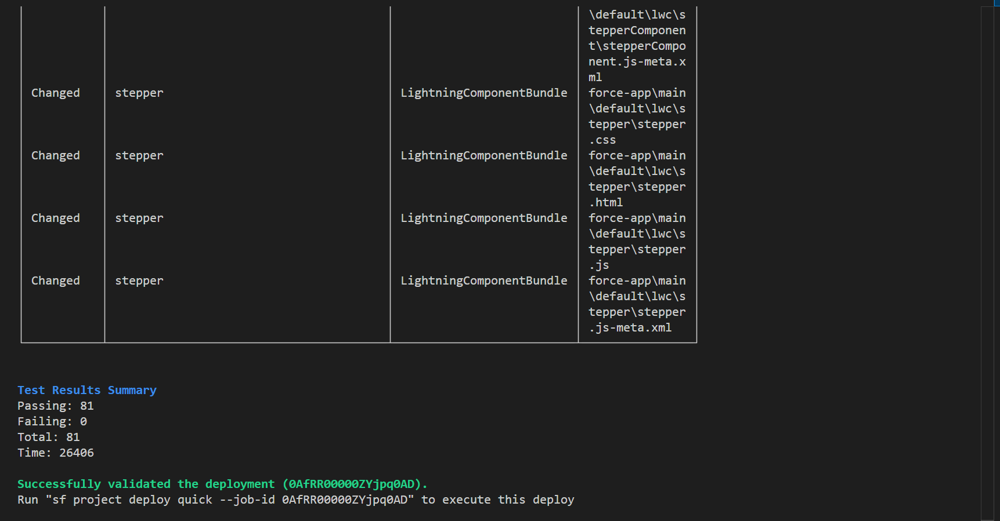

# test coverage with executing Validation before Deploy :

# Video link record with loom for project management

https://www.loom.com/share/54a86eac36144134a9af2156cc39d9c2?sid=b3acf7e7-412c-4854-a373-a612ff204074

# Salesforce DX Project: Next Steps

Now that you’ve created a Salesforce DX project, what’s next? Here are some documentation resources to get you started.

## How Do You Plan to Deploy Your Changes?

Do you want to deploy a set of changes, or create a self-contained application? Choose a [development model](https://developer.salesforce.com/tools/vscode/en/user-guide/development-models).

## Configure Your Salesforce DX Project

The `sfdx-project.json` file contains useful configuration information for your project. See [Salesforce DX Project Configuration](https://developer.salesforce.com/docs/atlas.en-us.sfdx_dev.meta/sfdx_dev/sfdx_dev_ws_config.htm) in the _Salesforce DX Developer Guide_ for details about this file.

## Read All About It

- [Salesforce Extensions Documentation](https://developer.salesforce.com/tools/vscode/)
- [Salesforce CLI Setup Guide](https://developer.salesforce.com/docs/atlas.en-us.sfdx_setup.meta/sfdx_setup/sfdx_setup_intro.htm)
- [Salesforce DX Developer Guide](https://developer.salesforce.com/docs/atlas.en-us.sfdx_dev.meta/sfdx_dev/sfdx_dev_intro.htm)
- [Salesforce CLI Command Reference](https://developer.salesforce.com/docs/atlas.en-us.sfdx_cli_reference.meta/sfdx_cli_reference/cli_reference.htm)
